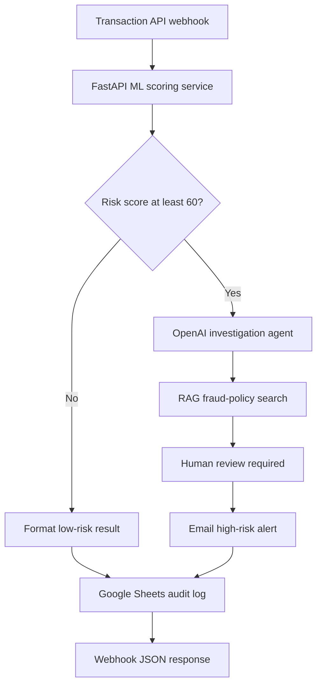

# AI Fraud Investigation Agent

An end-to-end AI fraud investigation system that combines **machine-learning
risk scoring**, **n8n workflow automation**, **retrieval-augmented generation
(RAG)**, **OpenAI reasoning**, automated alerting, audit logging, and mandatory
human review.

This project demonstrates how deterministic automation and generative AI can
work together to support fraud analysts without allowing an AI model to make
unreviewed customer-impacting decisions.

> **Portfolio demo:** The ML model and fraud-policy documents use synthetic
> data. This project is not a production fraud decisioning system.

## Business Problem

Fraud teams process large volumes of transactions while balancing two competing
risks:

- Missing genuinely fraudulent transactions.
- Creating unnecessary customer friction through false positives.

A risk score alone does not explain what happened, which evidence matters, or
which policy applies. Analysts still need to collect the relevant case details,
review policy, document their reasoning, and decide the next action.

## Solution

The system automatically screens each transaction and coordinates the next step:

1. A transaction enters n8n through an API webhook.
2. A FastAPI ML service calculates a fraud-risk score from 0 to 100.
3. Transactions scoring below 60 follow the standard monitoring path.
4. Transactions scoring 60 or above are escalated to the AI investigation agent.
5. The agent must search the fraud-policy knowledge base before making a
   policy-based recommendation.
6. The result is returned as structured JSON, logged in Google Sheets, and sent
   to the fraud team by email.
7. Every escalated case is marked `HUMAN_REVIEW_REQUIRED`.

## System Architecture



## Why Combine ML, RAG, and an AI Agent?

| Component | Responsibility |
| --- | --- |
| **ML model** | Detects risk patterns and produces a consistent transaction score. |
| **RAG** | Retrieves relevant fraud-policy text instead of relying on the language model's memory. |
| **AI agent** | Combines transaction evidence, model signals, and retrieved policy into an investigation summary and recommendation. |
| **n8n** | Controls routing, integrations, audit logging, alerts, and the final API response. |
| **Human analyst** | Reviews the evidence and makes the final customer-impacting decision. |

The AI agent does not replace the ML model or the analyst. It explains and
organises the evidence after the transaction has been flagged.

## Key Features

- REST API intake for transaction data.
- Random Forest fraud-risk scoring service built with Python and FastAPI.
- Reproducible model-training pipeline using synthetic demonstration data.
- Explainable risk indicators such as unusual amount, cross-border activity,
  new merchant, overnight transaction, high velocity, and failed attempts.
- Risk-based routing with an investigation threshold of 60.
- RAG-based fraud-policy retrieval using OpenAI embeddings.
- Strict JSON output for auditable downstream processing.
- Email alerts for high-risk cases.
- Google Sheets case logging.
- Docker and Render deployment configuration.
- Automated tests and GitHub Actions CI.
- Human-in-the-loop controls for all customer-impacting actions.

## Technology Stack

| Area | Technologies |
| --- | --- |
| Workflow orchestration | n8n |
| Machine learning | Python, scikit-learn, NumPy, joblib |
| API | FastAPI, Pydantic, Uvicorn |
| Generative AI | OpenAI, LangChain nodes |
| RAG | OpenAI embeddings, n8n in-memory vector store |
| Integrations | Gmail, Google Sheets, webhooks |
| Deployment | Docker, Render |
| Testing and CI | pytest, GitHub Actions |

## Repository Structure

```text
ai-fraud-investigation-agent/
├── .github/workflows/ci.yml
├── docs/
│   ├── google_sheets_columns.csv
│   └── portfolio_notes.md
├── examples/
│   ├── high_risk_transaction.json
│   └── low_risk_transaction.json
├── ml_api/
│   ├── app.py
│   ├── features.py
│   ├── train_model.py
│   ├── model.joblib
│   ├── requirements.txt
│   └── Dockerfile
├── n8n/
│   └── ai_fraud_investigation_workflow.json
├── tests/
│   ├── test_api.py
│   └── test_features.py
├── render.yaml
└── README.md
```

## ML Risk Scoring

The model uses nine transaction-level features:

- Amount-to-customer-average ratio.
- Cross-border transaction flag.
- New-merchant flag.
- Overnight transaction flag.
- Merchant risk score.
- Number of transactions in the previous 24 hours.
- Card-not-present flag.
- Recent failed attempts.
- High-risk merchant-category flag.

The API returns the original transaction fields together with:

```json
{
  "risk_score": 95,
  "risk_level": "HIGH",
  "fraud_probability": 0.95,
  "amount_to_average_ratio": 19.59,
  "risk_indicators": [
    "AMOUNT_SIGNIFICANTLY_ABOVE_CUSTOMER_AVERAGE",
    "CROSS_BORDER_TRANSACTION",
    "NEW_MERCHANT"
  ],
  "requires_investigation": true,
  "scoring_version": "ml-v1-random-forest-synthetic"
}
```

Risk routing rules:

| Score | Risk level | Workflow action |
| ---: | --- | --- |
| 0–39 | Low | Log and continue standard monitoring. |
| 40–59 | Medium | Log and continue monitoring. |
| 60–69 | Medium | Escalate to AI investigation. |
| 70–100 | High | Escalate, alert the fraud team, and require human review. |

## Run the ML API Locally

Requirements: Python 3.12 or later.

```bash
git clone https://github.com/thao181/ai-fraud-investigation-agent.git
cd ai-fraud-investigation-agent/ml_api

python -m venv .venv
source .venv/bin/activate
pip install -r requirements-dev.txt

python train_model.py
uvicorn app:app --reload --port 8000
```

Open `http://localhost:8000/docs` to use the interactive API documentation.

Test the high-risk example:

```bash
curl -X POST http://localhost:8000/predict \
  -H 'Content-Type: application/json' \
  --data-binary @../examples/high_risk_transaction.json
```

Health check:

```bash
curl http://localhost:8000/health
```

## Run the Tests

From the repository root:

```bash
pytest -q
```

The included GitHub Actions workflow also validates the n8n JSON and runs the
test suite on pushes and pull requests.

## Run with Docker

```bash
docker build -t fraud-risk-api ./ml_api
docker run --rm -p 10000:10000 fraud-risk-api
```

The API will be available at `http://localhost:10000`.

## Deploy the ML API to Render

1. Fork or clone this repository to your GitHub account.
2. In Render, create a new **Blueprint** and select the repository.
3. Render reads `render.yaml` and builds `ml_api/Dockerfile`.
4. Confirm the `/health` endpoint returns a healthy status.
5. Copy the Render service URL and add `/predict`.
6. Update the n8n node **Score Transaction Risk (ML API)** with that URL.

Example:

```text
https://YOUR-RENDER-SERVICE.onrender.com/predict
```

## Import and Configure the n8n Workflow

1. Open n8n and import
   `n8n/ai_fraud_investigation_workflow.json`.
2. Add credentials for OpenAI, Gmail, and Google Sheets.
3. In **Log Case in Google Sheets**, select your spreadsheet and use the column
   structure in `docs/google_sheets_columns.csv`.
4. In **Email High-Risk Alert**, replace
   `YOUR_FRAUD_TEAM_EMAIL@example.com` with the destination address.
5. Confirm the ML scoring node uses your Render `/predict` endpoint.
6. Run **Run Knowledge Base Setup** once to index the demonstration fraud
   policies.
7. Activate the workflow and test the production webhook:

```text
POST https://YOUR-N8N-DOMAIN/webhook/fraud-investigation
```

The current workflow uses an in-memory vector store, so the knowledge base may
need to be indexed again after an n8n restart.

## Example End-to-End Test

```bash
curl -X POST 'https://YOUR-N8N-DOMAIN/webhook/fraud-investigation' \
  -H 'Content-Type: application/json' \
  --data-binary @examples/high_risk_transaction.json
```

The expected result contains the ML risk assessment, AI investigation summary,
policy references, recommended action, and the final status
`HUMAN_REVIEW_REQUIRED`.

## Safety and Limitations

- The model is trained on synthetic data and is intended only for demonstration.
- The included policy documents are synthetic and must be replaced with approved
  organisational policies.
- The AI agent recommends actions but never blocks a card, contacts a customer,
  or makes a final fraud determination.
- Real deployment would require labelled production data, threshold calibration,
  bias and fairness testing, drift monitoring, authentication, access controls,
  encryption, rate limiting, secret management, and formal model governance.
- A qualified fraud analyst must review every customer-impacting decision.

## Future Improvements

- Train and validate the model using governed, labelled transaction data.
- Add probability calibration and cost-sensitive threshold optimisation.
- Replace the in-memory vector store with Qdrant, Supabase, or Pinecone.
- Add model-drift, data-quality, and service-performance monitoring.
- Store investigation cases in a controlled case-management database.
- Add analyst feedback for continuous model and prompt improvement.

## Author

**Morgan Le**

Master of Data Science, Monash University

[GitHub](https://github.com/thao181)
